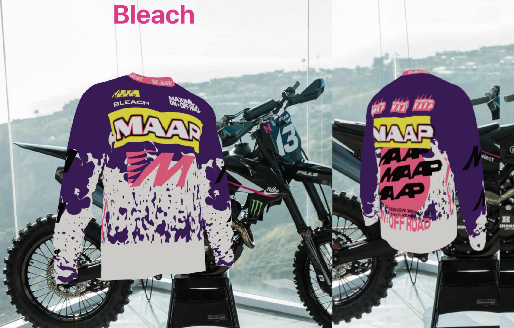

# 3D Project

## Overview
This is a 3D visualization project built using React and Three.js. The application leverages `@react-three/fiber` for rendering 3D objects and `@react-three/drei` for additional utilities. The project provides an interactive experience with 3D models and textures.



## Features
- Interactive 3D objects
- Uses `three.js` for rendering
- React-based architecture with `@react-three/fiber`
- Custom textures stored in the `public` folder

## Installation
To set up the project locally, follow these steps:

```sh
# Clone the repository
git clone https://github.com/avpizarro/bleach-top

# Navigate into the project directory
cd bleach-top

# Install dependencies
npm install
```

## Running the Project
To start the development server, run:
```sh
npm start
```
This will launch the application in your browser at `http://localhost:3000/`.

## Dependencies
This project relies on the following major dependencies:
- `@react-three/fiber` (3D rendering in React)
- `@react-three/drei` (Helper utilities for 3D scenes)
- `three` (3D graphics library)
- `react` and `react-dom` (Frontend framework)
- `react-scripts` (Build scripts for React projects)

## Project Structure
```
3d/
├── src/
│   ├── index.js      # Entry point
│   ├── App.js        # Main component
│   ├── App.css       # Styles
│   ├── index.css     # Global styles
│   └── reportWebVitals.js # Performance metrics
├── public/
│   ├── textures/     # 3D object textures
│   ├── bleach-top.png # Project showcase image
├── package.json      # Project metadata
└── README.md         # Project documentation
```

## Attribution
Favicon created using the icon [3D](https://thenounproject.com/icon/3d-5070845/) by [sun](https://thenounproject.com/creator/373184756/) from [The Noun Project](https://thenounproject.com).

## License
This project is licensed under the MIT License - see the [LICENSE](LICENSE) file for details.

## Contribution
Feel free to submit issues or pull requests if you'd like to contribute to the project.